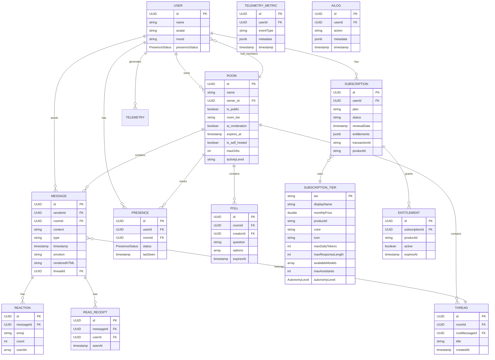

# Sinapse iOS App - Screens and Data Architecture

This document contains Mermaid diagrams representing all screens, navigation flow, and associated data models in the Sinapse iOS application.

## Complete Screen and Data Flow Diagram

## Data Model Relationships

## Navigation Flow Diagram

## Component Hierarchy

## Data Flow Diagram

## Screen Summary

### Authentication & Onboarding
- **OnboardingView** - Main onboarding entry point
- **WelcomeView** - Welcome screen
- **RoomTierView** - Room tier selection
- **TierSelectionView** - Subscription tier selection
- **OnboardingFlowView** - Multi-step onboarding flow

### Main Navigation
- **MainTabView** - Tab bar container (Home, Search, Settings)
- **RoomListView** - List of all rooms
- **SearchView** - Search messages, rooms, users
- **ProfileView** - User profile and settings

### Communication
- **ChatView** - Main chat interface
- **MessageBubbleView** - Individual message display
- **ChatInputView** - Message input component
- **ThreadView** - Threaded conversations
- **PollView** - Poll creation and voting

### Voice & Video
- **VoiceRoomView** - Voice room interface
- **VoiceVideoPanelView** - Video panel component
- **VoiceView** - Voice controls

### Room Management
- **CreateRoomSheet** - Create new room
- **RoomSettingsView** - Room configuration
- **DashboardView** - Room analytics dashboard

### Profile & Settings
- **SettingsView** - App settings
- **NicknameManagementView** - Manage nicknames
- **HostingGuideView** - Self-hosting guide
- **BotSetupView** - Bot configuration wizard

### Monetization
- **PaywallView** - Subscription paywall
- **SubscriptionView** - Subscription management
- **PricingSheet** - Pricing information

### Components
- **PresenceIndicatorView** - User presence indicator
- **PresenceOrbView** - Presence orb animation
- **QuickJumpBar** - Quick room access
- **LoadingSpinner** - Loading indicator
- **ErrorRecoveryView** - Error handling
- **ToastView** - Toast notifications
- **EmojiPickerView** - Emoji picker
- **FileUploadComponent** - File upload UI
- **ReadReceiptIndicator** - Read receipt display
- **ProgrammaticUIView** - Dynamic UI generation

## Data Models

### Core Models
- **Room** - Room/space data (id, name, owner, tier, moderation, expiry)
- **Message** - Message data (id, sender, content, type, timestamp, emotion, reactions)
- **User** - User profile (id, name, avatar, mood, presence)
- **SubscriptionTier** - Subscription tier configuration (Starter, Pro, Enterprise)

### Supporting Models
- **MessageReaction** - Emoji reactions on messages
- **TelemetryMetric** - Telemetry event data
- **AILog** - AI operation logs
- **IAPReceipt** - In-app purchase receipts
- **UXEventType** - UX event type definitions

