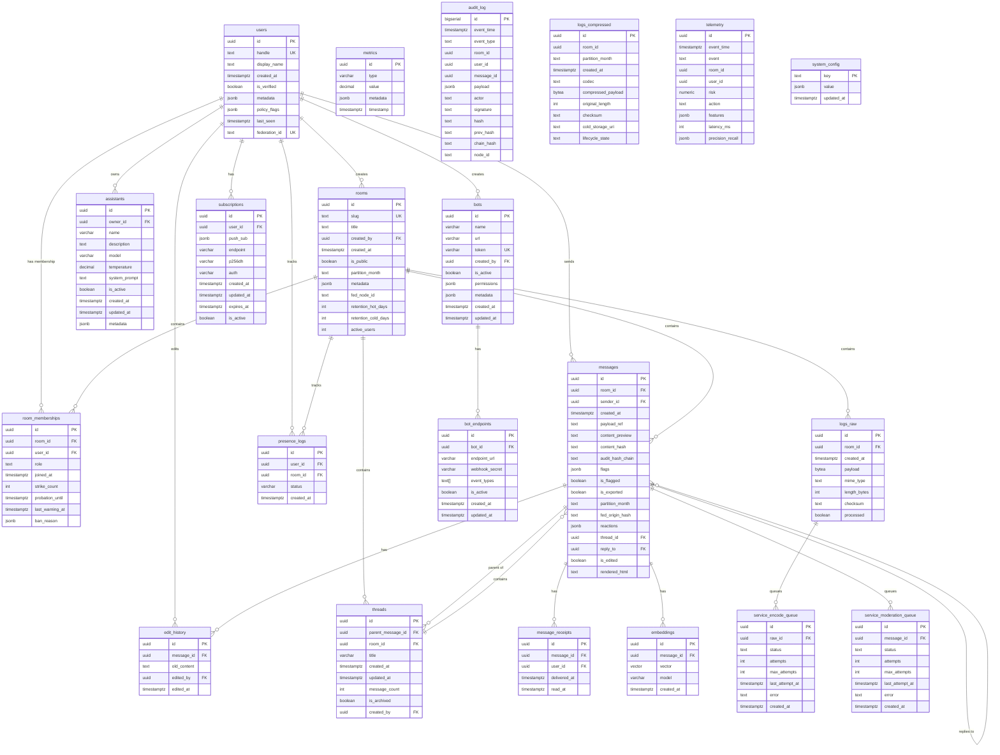

# Sinapse Database Schema

## Entity Relationship Diagram

## Table Descriptions

### Core Tables

#### `users`
User profiles with trust metadata and federation support.
- **Primary Key**: `id` (UUID)
- **Unique**: `handle`, `federation_id`
- **Key Fields**: handle, display_name, is_verified, metadata, policy_flags

#### `rooms`
Chat rooms with partition keys and retention overrides.
- **Primary Key**: `id` (UUID)
- **Unique**: `slug`
- **Key Fields**: slug, title, is_public, partition_month, retention settings

#### `room_memberships`
User memberships in rooms with roles and moderation tracking.
- **Primary Key**: `id` (UUID)
- **Unique**: (room_id, user_id)
- **Key Fields**: role, strike_count, probation_until, ban_reason

#### `messages`
Message records with content references and metadata.
- **Primary Key**: `id` (UUID)
- **Key Fields**: room_id, sender_id, content_preview, content_hash, reactions, thread_id, reply_to

### Feature Tables

#### `threads`
Message threads for nested conversations.
- **Primary Key**: `id` (UUID)
- **Key Fields**: parent_message_id, room_id, title, message_count, is_archived

#### `edit_history`
History of message edits.
- **Primary Key**: `id` (UUID)
- **Key Fields**: message_id, old_content, edited_by, edited_at

#### `assistants`
AI assistant configurations.
- **Primary Key**: `id` (UUID)
- **Key Fields**: owner_id, name, model, temperature, system_prompt, is_active

#### `bots`
Bot registrations with webhook URLs.
- **Primary Key**: `id` (UUID)
- **Unique**: `token`
- **Key Fields**: name, url, token, created_by, permissions, is_active

#### `bot_endpoints`
Webhook endpoints for bots.
- **Primary Key**: `id` (UUID)
- **Key Fields**: bot_id, endpoint_url, webhook_secret, event_types, is_active

#### `subscriptions`
Push notification subscriptions.
- **Primary Key**: `id` (UUID)
- **Key Fields**: user_id, push_sub (JSONB), endpoint, is_active

#### `embeddings`
Vector embeddings for semantic search.
- **Primary Key**: `id` (UUID)
- **Key Fields**: message_id, vector (1536-dim), model
- **Index**: HNSW index on vector for fast similarity search

#### `metrics`
Analytics and metrics tracking.
- **Primary Key**: `id` (UUID)
- **Key Fields**: type, value, metadata, timestamp

#### `presence_logs`
User presence tracking.
- **Primary Key**: `id` (UUID)
- **Key Fields**: user_id, room_id, status, created_at

### System Tables

#### `audit_log`
Append-only audit trail with chained hashes.
- **Primary Key**: `id` (BIGSERIAL)
- **Key Fields**: event_type, hash, chain_hash, node_id

#### `logs_raw`
Raw log payloads before compression.
- **Primary Key**: `id` (UUID)
- **Key Fields**: room_id, payload, mime_type, checksum, processed

#### `logs_compressed`
Compressed logs with partitioning.
- **Primary Key**: `id` (UUID)
- **Partitioned By**: `partition_month`
- **Key Fields**: room_id, codec, compressed_payload, lifecycle_state

#### `telemetry`
System telemetry and metrics.
- **Primary Key**: `id` (UUID)
- **Key Fields**: event, risk, action, features, latency_ms

#### `system_config`
System configuration key-value store.
- **Primary Key**: `key` (TEXT)
- **Value**: JSONB

### Service Schema Tables

#### `service.encode_queue`
Compression job queue.
- **Primary Key**: `id` (UUID)
- **Key Fields**: raw_id, status, attempts, max_attempts

#### `service.moderation_queue`
Moderation job queue.
- **Primary Key**: `id` (UUID)
- **Key Fields**: message_id, status, attempts, max_attempts

## Key Relationships

1. **Users ↔ Rooms**: Many-to-many via `room_memberships`
2. **Rooms ↔ Messages**: One-to-many
3. **Messages ↔ Threads**: One-to-many (threads have parent_message_id)
4. **Messages ↔ Messages**: Self-referential via `reply_to` for direct replies
5. **Users ↔ Assistants**: One-to-many (users own assistants)
6. **Users ↔ Bots**: One-to-many (users create bots)
7. **Bots ↔ Bot Endpoints**: One-to-many
8. **Messages ↔ Embeddings**: One-to-one (each message can have one embedding)

## Indexes

### Performance Indexes
- **Messages**: room_id + created_at (DESC), content_hash, reactions (GIN), thread_id
- **Threads**: room_id, parent_message_id, updated_at (DESC)
- **Embeddings**: HNSW index on vector for cosine similarity
- **Search**: GIN index on search_vector in materialized view

### Foreign Key Indexes
- All foreign keys have corresponding indexes for join performance

## Functions

1. **`update_thread_metadata()`**: Updates thread message_count and updated_at
2. **`refresh_message_search_index()`**: Refreshes search materialized view
3. **`mark_message_edited()`**: Tracks message edits in edit_history
4. **`match_messages()`**: Vector similarity search using pgvector
5. **`update_updated_at_column()`**: Auto-updates updated_at timestamps

## Triggers

1. **`trigger_thread_metadata_update`**: Updates thread metadata on message insert/delete
2. **`trigger_refresh_search_index`**: Refreshes search index (deferred)
3. **`trigger_mark_message_edited`**: Tracks edits when content changes
4. **`update_*_updated_at`**: Auto-updates updated_at for assistants, bots, subscriptions

## Materialized Views

### `message_search_index`
Full-text search index for messages.
- **Columns**: id, content, room_id, user_id, created_at, search_vector
- **Index**: GIN index on search_vector
- **Refresh**: Triggered automatically on message changes (deferred)

## Notes

- **Partitioning**: `logs_compressed` is partitioned by `partition_month`
- **Vector Search**: Uses pgvector extension with HNSW indexing
- **Audit Trail**: `audit_log` uses chained hashes for tamper-evident logging
- **Federation**: Tables support federation via `federation_id` and `fed_node_id` fields
- **Retention**: Room-level and system-level retention policies supported

